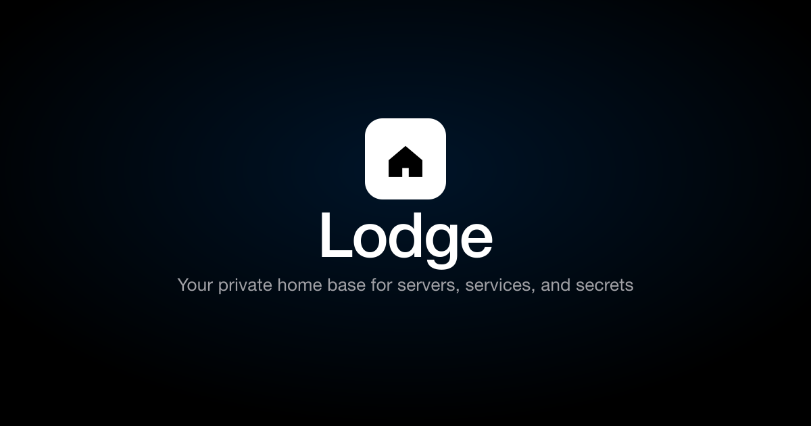
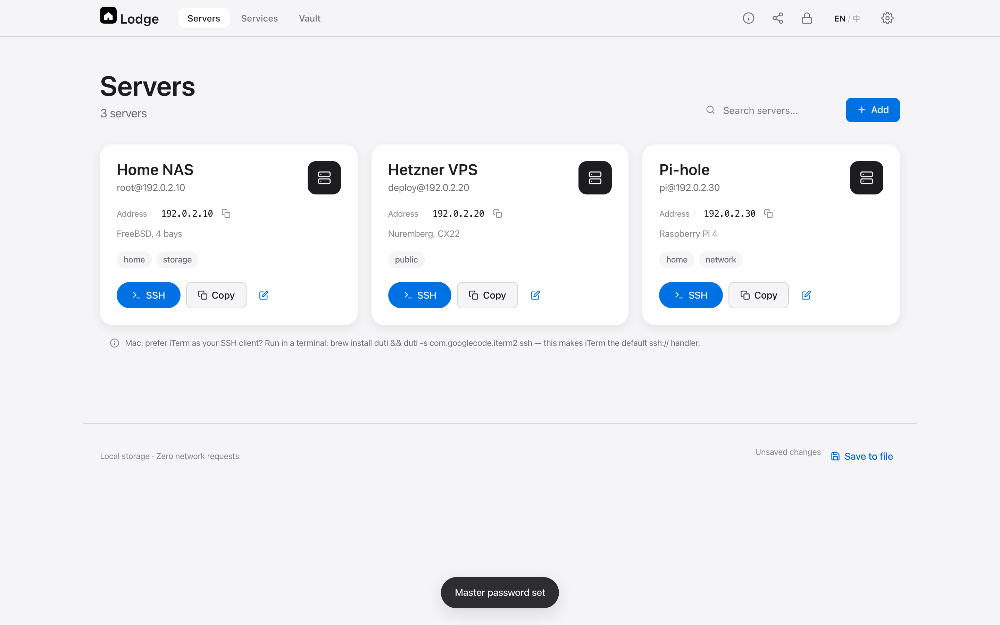
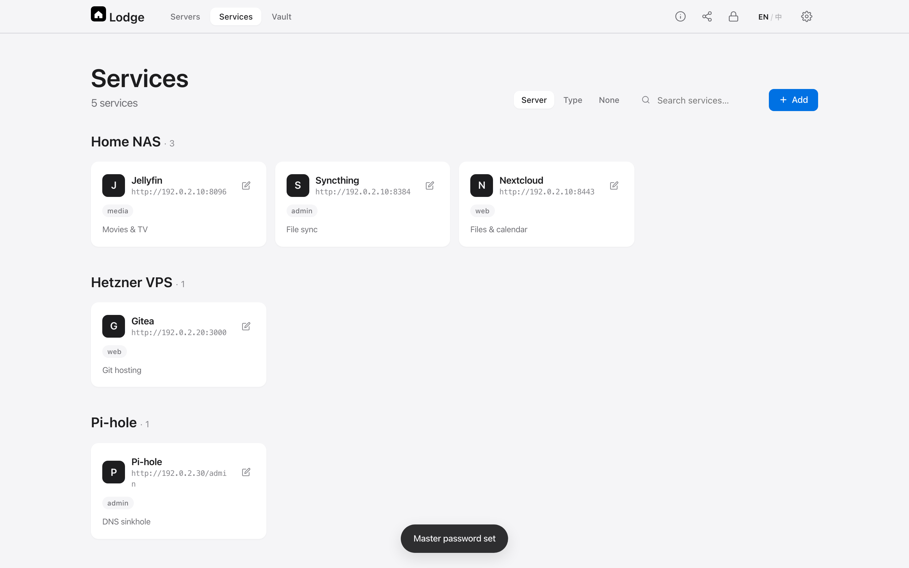
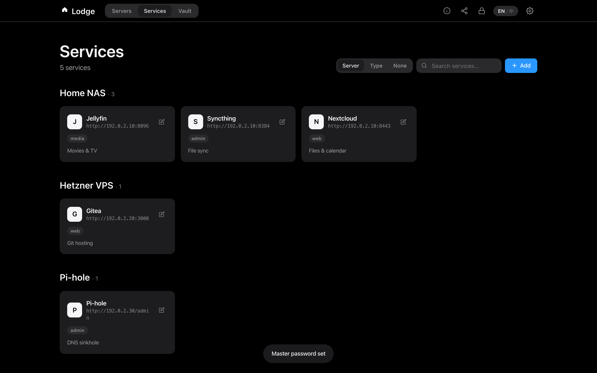

<p align="center">
  
</p>

<p align="center">
  <strong>Your private home base for servers, services, and secrets.</strong>
  <br>
  One HTML file. One JSON file. Zero servers. Zero telemetry. End-to-end encrypted.
</p>

<p align="center">
  <a href="https://local.lodge.weichao.studio">Try it</a>
  ·
  <a href="#quick-start">Quick start</a>
  ·
  <a href="https://local.lodge.weichao.studio/about.html">About page</a>
  ·
  <a href="README.md">中文文档</a>
</p>

<p align="center">
  <a href="LICENSE"></a>
  
  
  
  
  
</p>

<br>

<p align="center">
  
</p>

---

## See it in action

Real screenshots from a fresh dashboard. Setup is one master password; everything below is just the JSON you'd otherwise maintain in a spreadsheet.

<p align="center">
  
</p>

<p align="center">
  <em>Servers tab — aliases, tags, one-click SSH, copy-to-clipboard fallback.</em>
</p>

<br>

<p align="center">
  
</p>

<p align="center">
  <em>Services tab — grouped by host, filter by type, millisecond search.</em>
</p>

<br>

<p align="center">
  
</p>

<p align="center">
  <em>Dark mode — same data, follows your system theme.</em>
</p>

---

## TL;DR

Every maker accumulates three things: **machines, services, and tokens**. Lodge puts all three in one private dashboard — a single HTML file that opens in any browser, syncs through iCloud Drive, and encrypts secrets in-browser before they ever touch a disk.

- 🖥 **Server inventory** — aliases, tags, SSH credentials, one-click terminal launch
- 🔗 **Service catalog** — group web apps, media servers, admin panels by host, search in milliseconds
- 🔒 **Encrypted vault** — AES-GCM 256, master password derived in-browser only, PBKDF2-SHA256 600k
- 📁 **Two files** — `dashboard.html` + `config.json`. No build, no backend, no account

---

## Why Lodge?

The alternatives each miss something:

| You want to… | So you use… | And end up with… |
|---|---|---|
| Remember server IPs and SSH ports | A spreadsheet, sticky notes | Out of date within a week |
| Bookmark every self-hosted service | Browser bookmarks | Lost on every browser reset |
| Store API tokens safely | 1Password, Bitwarden | Yet another subscription, master-password fatigue |
| Get a glanceable "what's running where" | Heimdall, Homarr, Dashy | Heavy Docker stack for what should be a single file |

Lodge is **all of the above, in one HTML file**. Open DevTools → Network tab → refresh: nothing happens. That's the whole architecture.

> *"Drop two files. Set one password. Done."* — from the [about page](https://local.lodge.weichao.studio/about.html)

---

## Features

### 🖥 Server inventory

Every machine you operate, one list.

- Aliases, hostnames, SSH ports and users at a glance
- Tags and free-form notes per server
- One click → launch your default SSH client (Terminal, iTerm, Termius, Prompt…)
- Falls back to clipboard with a `ssh user@host -p port` command
- Clipboard auto-clears 30 seconds after copy

### 🔗 Service catalog

Every endpoint, one tap.

- Icon, name, URL, type (media, web, admin, database, …)
- Group by host with a single `serverId` reference
- Search across hundreds in milliseconds
- Open in a new tab — no in-app browser gymnastics

### 🔒 Encrypted vault

Every secret, one master password.

- AES-GCM 256 with a unique IV per item — identical values produce different ciphertext
- PBKDF2-SHA256 key derivation, 600,000 iterations (OWASP 2023 baseline)
- Master password never stored, never uploaded, never logged — derived in memory only
- `verifier` field proves you typed the right password without decrypting anything
- Plaintext cleared on lock and on tab close
- Clipboard auto-clears 30 seconds after copy

### 📁 Sync & devices

- Drop `dashboard.html` and `config.json` into iCloud Drive / Dropbox / Syncthing → every device sees the same data
- Or self-host on Vercel / Netlify / GitHub Pages / Tailscale Funnel / Cloudflare Tunnel
- `localStorage` cache means after the first file picker, opens are instant
- Responsive: phone, tablet, desktop — same HTML file

---

## Quick start

Three ways to run it. Pick whichever fits.

### A. Use the hosted demo — zero config

👉 **<https://local.lodge.weichao.studio>**

The root URL 301-redirects to the dashboard. Works in any modern browser on macOS, Windows, Linux, iPhone, iPad.

> The hosted version only serves the HTML/JS code. Your real `config.json` lives in **your** iCloud Drive (or wherever you put it). An attacker hitting the URL just sees an empty file picker.

### B. Clone and double-click — no server

```bash
git clone https://github.com/toolazytoname/lodge.git
cd lodge
open dashboard.html        # macOS
xdg-open dashboard.html    # Linux
start dashboard.html       # Windows
```

Lodge detects `file://` and switches to file-picker + `localStorage` cache. Web Crypto API works on `file://` in every modern browser, so the vault is fully functional.

### C. Self-host on your own URL

For HTTPS access from your phone or sharing across devices.

```bash
# Vercel (zero config, free HTTPS, custom domain)
npx vercel --prod

# GitHub Pages
# Settings → Pages → Deploy from branch → main / root

# Your own server via Tailscale Funnel (no DNS work)
tailscale funnel 9001

# Or Cloudflare Tunnel (no account needed, 5-minute setup)
cloudflared tunnel --url http://localhost:9001
```

See **[DEPLOY.md](DEPLOY.md)** for the full walkthrough.

---

## How it works

```
   ┌──────────────────────────────────────────────────────┐
   │  dashboard.html   (~90 KB single file, all CSS/JS    │
   │                    inlined, zero external requests)  │
   └─────────────────┬────────────────────────────────────┘
                     │
                     │  reads on every load
                     ▼
   ┌──────────────────────────────────────────────────────┐
   │  config.json     (your data — servers, services,     │
   │                   vault ciphertext, settings)         │
   └─────────────────┬────────────────────────────────────┘
                     │
                     │  synced via
                     ▼
   ┌──────────────────────────────────────────────────────┐
   │  iCloud Drive · Dropbox · Syncthing · your server    │
   │  (your choice — Lodge doesn't care)                  │
   └──────────────────────────────────────────────────────┘
```

**On every load, in your browser:**

1. Read `config.json` (from server, file picker, or `localStorage` cache)
2. Show servers, services, and metadata — all plaintext (by design, so you can see them)
3. For vault items, prompt for master password if locked
4. Derive the AES key with PBKDF2-SHA256 (600k iterations) — never persisted
5. Decrypt vault items in-memory, render them
6. Clear plaintext when you lock or close the tab

There is no other step. There is no server. There is no telemetry.

---

## Security model

| Aspect | Implementation |
|---|---|
| Master password | Never stored, never uploaded — derived in memory only |
| Key derivation | PBKDF2-SHA256, 600,000 iterations (OWASP 2023) |
| Data encryption | AES-GCM 256, unique IV per vault item |
| Password verification | `verifier` field proves the password without decrypting anything |
| Memory hygiene | Plaintext cleared on lock and on tab close |
| Clipboard | Auto-clears 30s after copy (SSH and vault) |
| Attack surface | **Zero network requests, zero servers, zero third parties** |
| Telemetry | None |
| Analytics | None |

### Attack scenarios

| Scenario | Consequence |
|---|---|
| iCloud account compromised | Attacker gets ciphertext + metadata — vault stays sealed without master password |
| Config file accidentally leaked | Server IPs exposed; vault remains encrypted |
| Device lost / stolen | Active session could be read → set a short auto-lock (default: 5 min) |
| Master password cracked | All tokens exposed — pick a strong one, don't reuse |
| Supply-chain attack on a CDN | Not applicable — Lodge has no CDN dependencies |

### Known boundaries (intentional)

- **Metadata in `config.json` is plaintext** — server names, IPs, service URLs. This is by design: without it the app can't show your services. Encrypting metadata would require decrypting on every render.
- **`localStorage` cache contains plaintext metadata** (no vault keys). Wipe it before switching devices via Settings → Clear local cache.
- **Browser history records the URL.** Use local deployment, Tailscale, or short-lived tunnels to avoid public traces.

---

## Data format (`config.json`)

One file. Versioned. Hand-editable.

```jsonc
{
  "version": 1,
  "meta": { "created": "2025-01-01T00:00:00Z", "lastModified": "2025-01-01T00:00:00Z" },

  "servers": [
    {
      "id": "nas",
      "alias": "Home NAS",
      "host": "192.168.1.10",
      "sshPort": 22,
      "sshUser": "root",
      "tags": ["home"],
      "notes": "FreeBSD, 4 bays"
    }
  ],

  "services": [
    {
      "id": "jellyfin",
      "name": "Jellyfin",
      "url": "http://192.168.1.10:8096",
      "type": "media",
      "icon": "J",
      "serverId": "nas",
      "description": "Movies & TV"
    }
  ],

  "vault": {
    "kdf": "PBKDF2-SHA256",
    "iterations": 600000,
    "salt": "<base64>",
    "verifier": "<base64>",
    "verifierIv": "<base64>",
    "items": [
      {
        "id": "uuid",
        "type": "token",
        "title": "GitHub PAT",
        "url": "https://github.com",
        "username": "you",
        "ciphertext": "<base64>",
        "iv": "<base64>",
        "createdAt": "ISO",
        "updatedAt": "ISO"
      }
    ]
  },

  "settings": {
    "autoLockMinutes": 5,
    "theme": "auto",
    "clearClipboardSeconds": 30
  }
}
```

Edit through the UI for safety, or hand-edit if you know what you're doing. See [`config.example.json`](config.example.json) for a sanitized starter.

---

## Cross-device use

| Mode | Best for | Setup |
|---|---|---|
| **Hosted demo** | Trying it out, single device | Open <https://local.lodge.weichao.studio>, pick your config |
| **iCloud Drive** | Personal, 1–3 Apple devices | Drop both files in iCloud Drive, open from any device |
| **Dropbox / Syncthing** | Mixed-OS households | Same as iCloud |
| **Vercel + your config server** | Public-ish URL with full HTTPS | Push HTML to Vercel, serve `config.json` from Cloudflare Tunnel |
| **Tailscale Funnel** | Personal, no DNS work | `tailscale funnel 9001` → `https://machine.tail-net.ts.net` |
| **Cloudflare quick tunnel** | Temporary public URL | `cloudflared tunnel --url http://localhost:9001` |

The first time on a new device you pick the file; afterwards `localStorage` caches it. To switch configs: Settings → Clear local cache.

---

## Comparison

| | Lodge | Bitwarden / Vaultwarden | Heimdall / Homarr |
|---|---|---|---|
| Server inventory | ✅ | ❌ | partial (bookmarks) |
| Service catalog | ✅ | ❌ | ✅ |
| Token vault | ✅ | ✅ (their core) | ❌ |
| Zero-knowledge encryption | ✅ | ✅ | ❌ |
| Self-hostable | ✅ (one HTML) | needs Docker stack | needs Docker stack |
| Build step | none | none | none |
| Backend required | none | required | required |
| Single file | ✅ | ❌ | ❌ |
| Mobile-friendly | ✅ | ✅ | partial |
| Runs offline | ✅ (file://) | ❌ | ❌ |
| Cost | free | free / $10/yr | free |

**When to pick something else:**
- You need TOTP autofill → **1Password** / **Bitwarden** / **Authy**
- You need a web SSH terminal → **Termius** / **Shellngn**
- You need a multi-user / team dashboard → **Homarr** + **Vaultwarden**

---

## Out of scope

Lodge deliberately **doesn't** do:

- Web SSH terminal (use `ssh://` deep links or your local terminal)
- TOTP autofill (use 1Password / Bitwarden / Authy)
- Multi-user / team collaboration
- Server-side health checks (ping it yourself)
- Automatic cloud sync (use iCloud / Syncthing)
- File or image attachments in vault
- Browser extensions

If any of those are dealbreakers, you're not the audience — and that's fine. Lodge is for the person who'd rather have one HTML file they fully understand than yet another SaaS to audit.

---

## FAQ

**What if I forget my master password?**
There is no recovery. That's the cost of zero-knowledge. Write it down physically and store it somewhere safe — that's the design.

**Why not WebAuthn / passkey support?**
Because Lodge has no server to register credentials against. When the ecosystem catches up to local-first passkey UX, this might change.

**Can I use Lodge on iPhone?**
Yes, but use the **hosted demo** or **Tailscale Funnel** URL — Safari on `file://` disables Web Crypto, which breaks the vault. The setup screen and dashboard work; only the encrypted vault requires a secure context.

**Does Lodge phone home?**
No. Open DevTools → Network → hard refresh — every page load is silent.

**Can I migrate from another tool?**
Hand-roll your `config.json`. The schema is small and documented above. No importer yet; PRs welcome.

**How do I back up?**
Your `config.json` *is* the backup. Copy it anywhere — iCloud Drive, a USB stick, your email. Lose the master password and you've still lost the vault; lose the file and you've lost everything else.

**Is there a CLI?**
No. Lodge is intentionally a single static page; adding a CLI would defeat the "one file" promise.

---

## Roadmap

- [x] Single-file static SPA
- [x] Zero-knowledge vault (AES-GCM 256)
- [x] iCloud / Dropbox / custom-server sync
- [x] One-click SSH launch
- [x] Responsive layout
- [x] Theme (auto / light / dark)
- [x] Clipboard auto-clear
- [x] Per-device `localStorage` cache
- [ ] Importers: Bitwarden CSV, 1Password export
- [ ] Optional read-only public sharing (e.g. share a service URL without exposing the dashboard)
- [ ] WebAuthn / passkey unlock (when local-first support stabilizes)

Have an idea? [Open an issue](https://github.com/toolazytoname/lodge/issues).

---

## Development

Single HTML file. All CSS and JS inlined. No build step.

```bash
git clone https://github.com/toolazytoname/lodge.git
cd lodge
python3 -m http.server 9001
# open http://localhost:9001/dashboard.html
```

**Editing the app** — open `dashboard.html` in any text editor. The `<style>` and `<script>` blocks are at the bottom; extract them into separate files if you prefer to maintain them that way.

**Tests** — Playwright end-to-end suite in `scripts/`:

```bash
npm install
npm test            # unit + integration
npm run test:e2e    # full browser flow
npm run lint:js     # syntax check
```

**Project layout**

```
dashboard.html       The app (~90 KB, single file, all CSS/JS inlined)
config.example.json  Sanitized starter config (safe to commit)
about.html           Marketing / about page (served at /about.html)
vercel.json          Redirects + CSP / security headers
scripts/             Playwright E2E + shell tests
assets/              Logo SVGs + og.png social preview
DEPLOY.md            Deploy walkthrough (GitHub + Vercel + self-host)
PRODUCTION.md        Reference URLs (no code reads this)
LICENSE              MIT
```

---

## Contributing

PRs welcome for small, focused improvements. Before opening a PR:

1. Search existing issues / PRs
2. For anything beyond a typo, open an issue first to align on direction
3. Keep the single-file promise — no build step, no new dependencies unless absolutely necessary

For security issues, **don't** open a public issue — email <lazywc@gmail.com>.

---

## License

[MIT](LICENSE)

---

<p align="center">
  Built by <a href="https://github.com/toolazytoname">@toolazytoname</a>
  · <a href="mailto:lazywc@gmail.com">lazywc@gmail.com</a>
</p>
