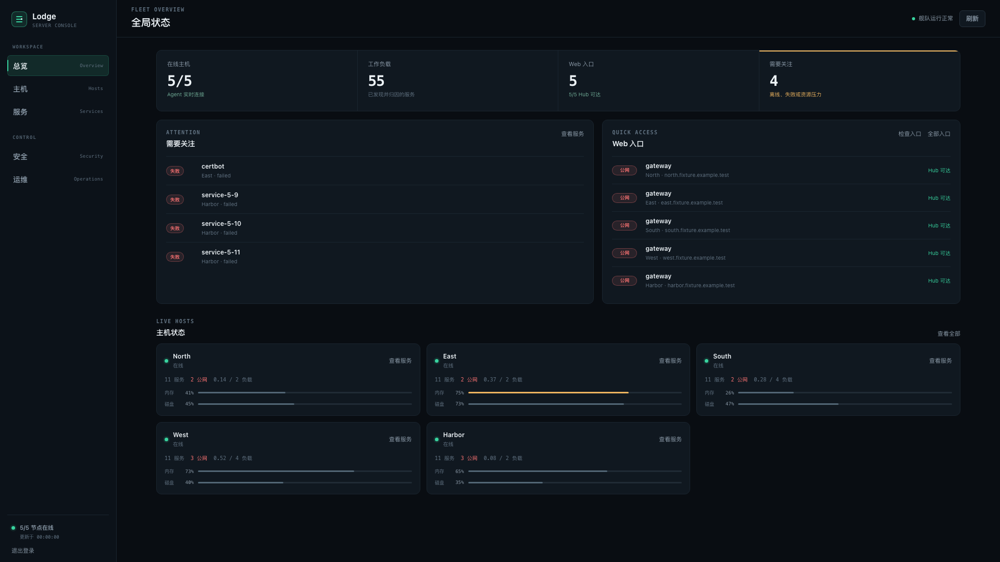

<p align="center">
  <strong>你的私人服务器 / 服务控制台。</strong>
  <br>
  hub + agent 架构，Go 单静态二进制。
</p>

<p align="center">
  <a href="README.en.md">English docs</a>
</p>

<p align="center">
  <a href="LICENSE"></a>
  
  
</p>

<p align="center">
  
  <br>
  <sub>匿名演示数据：不含真实主机名、域名、IP、登录态、服务日志或告警来源。</sub>
</p>

---

## 这是什么

每台自己维护的服务器上跑着什么服务、暴露到哪里（只本机可访问 / 只 tailnet 内可访问 / 公网可达），一目了然——而不是靠手工表格，一周后就过时。

- **agent**：部署在每台被管机器上，非 root 账号运行，只读采集端口、容器、Compose 身份、自建/失败 systemd 单元、脱敏进程来源、Caddy/Nginx Web 路由、最近 SSH 认证失败来源聚合，以及有效 SSH/本机防护姿态。特权采集走 sudoers 精确白名单；不支持任意命令执行。
- **hub**：中心节点，定期拉取各 agent 的状态，提供 Web 界面统一查看；当前使用密码登录 + 登录限速，将观测历史、去重事件生命周期与受控操作审计持久化到 SQLite，提供按主机的有界趋势、SSH 爆破来源事件、事件筛选/确认、可选的可靠 Webhook 通知、显式 Web 入口检查，以及由 root 策略批准并逐字确认的启动/停止/重启/近期日志、固定摘要部署和回滚。vault 仍在路线图中，未完成前不作为安全承诺。

## 架构

```
浏览器 ──HTTPS──> lodge-hub  ──Tailscale tailnet──> lodge-agent × N
                (Go，内嵌前端)                    (非 root，sudoers 白名单)
```

hub 主动拉取（非 agent 推送），机器都在同一个 tailnet 里；agent 只监听 `127.0.0.1`，通过 Tailscale Serve 仅向 tailnet 中获授权的 hub 提供数据，不能使用 Funnel 暴露到公网。

## 安全模型

- **agent 绝不以 root 运行**，专用系统账号，不加入 `docker` 组（docker 组等价 root）。特权采集走完整 argv 精确白名单；受控操作只允许一个固定 `--execute-action` sudo 入口，从 stdin 接收有界动作 ID，再由不可被 `lodge` 替换的 root-only `/etc/lodge-agent/actions.json` 映射到固定命令，不接受 shell、命令、参数或路径。SSH 监测只从有界认证日志尾部或有界 journal 窗口输出 canonical 来源 IP/count，不输出用户名或原始日志；SSH 防护姿态也只输出固定枚举，不输出用户、密钥、规则、地址或原始命令结果。进程归属不读取命令行、环境变量或完整路径；反向代理发现不读取容器环境变量、不执行 `docker exec`，Nginx include 也被限制在 `/etc/nginx` 内，只输出脱敏路由与无凭据上游地址。
- **hub 登录**：Argon2id 慢哈希 verifier，不保存明文密码；独立随机密钥签名会话，Cookie 使用 `Secure`、`HttpOnly`、`SameSite=Strict`，写操作验证 CSRF token；连续失败按指数退避锁定。
- **管理面边界**：生产管理面只允许在 Tailnet 内开放；登录认证是纵深防御，不是公网暴露的许可。Hub 不接受命令、参数或目标，只能执行 Agent 实时策略返回的动作/发布 ID；每次写操作要求 CSRF 与逐字确认、全局串行、执行后验证和持久审计，远程 POST 不重试，日志不入审计。发布只允许 root 预先登记的无状态单服务、固定 sha256 镜像和本机健康检查，失败自动尝试恢复上一已验证版本。vault 仍在路线图中，未完成前不作为安全承诺。
- **持久化边界**：Agent URL/token 只存在于 `0600` 私有配置和进程内存，不进入 SQLite；数据库、WAL、备份均为 `0600`，迁移有版本与校验和门禁。

## 开发

需要 Go 1.25.12 或更新的受支持工具链；CI 固定使用最新 Go 1.26.x。

```bash
go build ./...
GOOS=linux GOARCH=amd64 go build -o dist/lodge-agent ./cmd/lodge-agent
GOOS=linux GOARCH=amd64 go build -o dist/lodge-hub ./cmd/lodge-hub

npm test    # 本地完整质量门禁（format/vet/build/test/race/脚本与文档数据检查）
```

## 目录结构

```
cmd/lodge-agent/    agent 入口
cmd/lodge-hub/      hub 入口
internal/agent/     采集、服务发现关联、白名单动作
internal/domain/    持久化业务模型与不变量
internal/storage/   SQLite 迁移、历史、备份
internal/hub/       API、投影、采集器、认证、登录限速
internal/shared/    共享类型
frontend/src/       TypeScript 前端源码与 Go 生成的 API 类型
internal/hub/web/   编译产物（内嵌进 hub 二进制）
deploy/             systemd unit、sudoers 模板、install-agent.sh
docs/               架构、威胁模型、质量门禁与开发规范
quality/            可量化质量基线与目标
```

## 工程规范

- [架构](docs/architecture.md)
- [威胁模型](docs/threat-model.md)
- [Hub 认证配置与迁移](docs/hub-authentication.md)
- [持久化、迁移与备份](docs/storage.md)
- [Webhook 事件通知](docs/webhook-notifications.md)
- [Tailnet-only 部署](docs/tailnet-deployment.md)
- [Agent 安全纳管](docs/agent-onboarding.md)
- [SSH 安全监测](docs/ssh-security-monitoring.md)
- [声明式部署与回滚](docs/declarative-deployments.md)
- [窄权限托管升级器](docs/managed-updaters.md)
- [质量门禁](docs/quality-gates.md)
- [Web 控制台与浏览器验收](docs/web-console.md)
- [开发与验收](docs/development.md)
- [实施路线](docs/roadmap.md)

## 贡献

欢迎小而专注的 PR。超过 typo 范围的改动，先开 issue 对齐方向。安全问题**别**开公开 issue —— 邮件 <lazywc@gmail.com>。

## License

[MIT](LICENSE)

<p align="center">
  Built by <a href="https://github.com/toolazytoname">@toolazytoname</a>
  · <a href="mailto:lazywc@gmail.com">lazywc@gmail.com</a>
</p>
